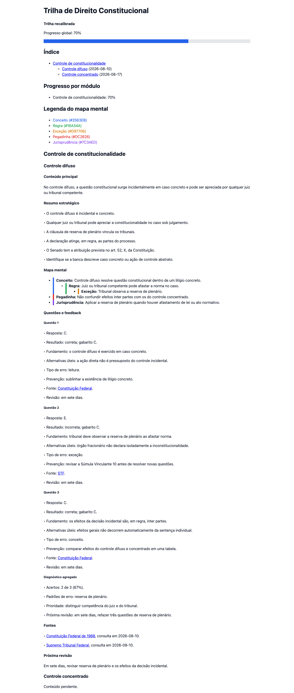
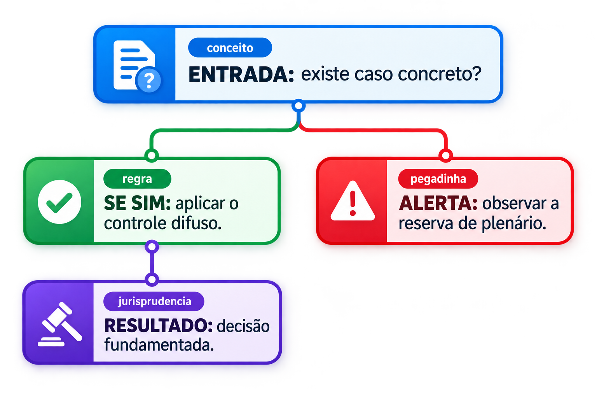

# Concurso Direito Tutor

<p align="center">
  
</p>

<p align="center">
  <a href="https://github.com/jocielle-tech/concurso-direito-tutor"></a>
  
  
  
</p>

Uma skill para transformar a preparação para concursos públicos de Direito em uma trilha persistente, auditável e visual. Ela une ensino focado na prova, recuperação ativa, fontes oficiais e materiais fáceis de reencontrar por assunto ou por tipo.

> O conteúdo é orientado ao estudo para concursos brasileiros. Confirme legislação, jurisprudência, súmulas, editais e regras de banca em fontes oficiais atualizadas.

## Novidades

- Cada sessão principal traz **exatamente 20 questões juntas**, corrigidas somente depois das 20 respostas.
- O material agora usa uma **árvore híbrida**: a sessão canônica fica no tópico e resumos, mapas, questões, painéis e revisões também podem ser encontrados por tipo.
- A apostila é construída nos três formatos: **Markdown**, **HTML interativo** e **PDF**.
- Cada tópico concluído pode ganhar um **mapa algorítmico visual nativo**, com cache por conteúdo e sem API key.
- O HTML é um dashboard de estudo moderno: índice lateral, tópico ativo sincronizado à rolagem, navegação utilizável sem JavaScript, ampliação do mapa e estilo de impressão. O PDF acompanha a mesma hierarquia visual e preserva o algoritmo pesquisável.
- Trilhas antigas são detectadas com segurança, recebem backup ZIP e podem ser migradas sem perder sessões.

## O resultado

Esta é uma captura de uma apostila HTML gerada por uma trilha de exemplo: índice lateral, tópico ativo, progresso, mapa mental e questões formatadas fazem parte do mesmo documento.

<p align="center">
  
</p>

## Mapas algorítmicos nativos

O mapa textual continua sendo a fonte de verdade. Ao concluir um tópico, a skill prepara um pedido de imagem com os rótulos jurídicos do algoritmo e usa a geração nativa do Codex — **sem `OPENAI_API_KEY`, CLI de imagem ou serviço externo**. O PNG aprovado é apenas um complemento visual da apostila.

<p align="center">
  
</p>

```text
tópico concluído → prepare_visual_map.py → ready: reutilizar cache
                                      └→ missing/invalid: imagegen nativo → inspecionar → salvar PNG
                                                                  └→ indisponível ou segunda falha: fallback textual
```

O cache fica em `assets/mapas/<topico>-<hash>/<source_hash>.png`. A versão visual atual (`dashboard-modern-v3`) invalida apenas a chave de cache anterior, sem apagar PNGs antigos; alterar o mapa textual também cria uma nova chave. O título atual do tópico fica fora dos pixels e é renderizado pelo HTML/PDF, por isso renomeá-lo não provoca nova imagem. O HTML incorpora imagens válidas em Base64; o PDF usa os mesmos bytes. Em ausência ou invalidez, ambos mantêm o fluxograma textual determinístico.

## Instalação

Clone o repositório, instale as dependências de geração e validação de PDF e coloque a pasta da skill no diretório de skills do Codex:

```bash
git clone https://github.com/jocielle-tech/concurso-direito-tutor.git
cd concurso-direito-tutor
python3 -m pip install -r requirements.txt
mkdir -p ~/.codex/skills
cp -R . ~/.codex/skills/concurso-direito-tutor
```

Em instalações que definem `CODEX_HOME`, use o respectivo diretório `skills`. Recarregue o Codex após a cópia. O PDF requer ReportLab; `pypdf` e `pdfplumber` apoiam a validação. O comando `--check` funciona sem precisar gerar PDF.

## Como usar

No Codex, comece com um pedido concreto. A skill coleta apenas dados que mudam a estratégia: cargo, banca, edital, nível, tempo disponível e objetivo.

```text
Use $concurso-direito-tutor para criar uma trilha de Direito Constitucional
para Analista Jurídico. Tenho 6 horas por semana e ainda não tenho edital.
```

Para abrir uma sessão principal, a prática vem toda de uma vez: 20 questões, numeradas de 1 a 20, sem gabarito. A correção individual e o diagnóstico só aparecem depois das 20 respostas.

```text
Vamos estudar controle difuso. Explique o núcleo de prova, apresente as 20
questões no estilo Cebraspe e espere minhas respostas antes de corrigir.
```

Se o estudante abandonar explicitamente as questões pendentes, a sessão fica `in_progress`: somente as respondidas são corrigidas e o progresso não aumenta. Ao concluir, cada feedback contém `Tópico`, resultado, fundamento, alternativas úteis, tipo de erro, prevenção, fonte e revisão.

Para uma dúvida pontual, basta perguntar. Dúvidas rápidas não criam nem encerram sessões artificialmente.

## Estrutura híbrida e formatos

`trilha.json` e os arquivos de sessão são as fontes de verdade. Os painéis, consolidações, agendas e apostilas são derivados. Uma sessão com vários tópicos tem uma única fonte canônica no primeiro tópico; os materiais dos demais tópicos apontam para ela, sem duplicar conteúdo.

```text
estudos/direito-constitucional/
├── trilha.json
├── painel/
│   ├── indice.md
│   ├── progresso.md
│   └── agenda-de-revisoes.md
├── modulos/01-direito-constitucional/topicos/01-controle-difuso/
│   ├── sessoes/001-controle-difuso.md
│   ├── resumo.md
│   ├── mapa-mental.md
│   └── questoes.md
├── materiais/{resumos,mapas-mentais,caderno-de-questoes}.md
├── revisoes/agenda.md
├── apostila/{apostila.md,apostila.html,apostila.pdf}
├── assets/mapas/<topico>-<hash>/<source_hash>.png
└── backups/
```

| Saída | Uso |
| --- | --- |
| `apostila/apostila.md` | Texto cumulativo para versionamento e leitura rápida. |
| `apostila/apostila.html` | Dashboard autocontido: índice lateral fixo, links internos, tópico ativo sincronizado, progresso, questões em cartões e mapa visual ampliável. |
| `apostila/apostila.pdf` | Caderno paginado para estudo ou impressão, com hierarquia visual moderna, mapa e algoritmo pesquisável. |

Gere a árvore e os três formatos ao encerrar uma sessão concluída:

```bash
python3 scripts/build_trilha.py estudos/direito-constitucional
```

Valide uma trilha sem escrever:

```bash
python3 scripts/build_trilha.py --check estudos/direito-constitucional
```

## Retomar e migrar uma trilha antiga

Sempre rode `--check` antes de retomar. Se o resultado for exatamente `MIGRATION_REQUIRED`, avise o estudante e migre a estrutura:

```bash
python3 scripts/build_trilha.py --migrate estudos/direito-constitucional
```

A migração cria um ZIP em `backups/`, preserva IDs, estados e conteúdo das sessões, reorganiza os caminhos canônicos e não repete trabalho se já estiver concluída. Se o `--check` retornar qualquer outro erro, corrija-o antes de gerar arquivos.

## Progresso e mapa mental

O progresso é ponderado: cada tópico tem peso positivo e somente tópicos concluídos entram na porcentagem. Uma trilha provisória pode ser recalibrada quando o edital chegar, sem apagar sessões ou estados.

Os mapas mentais usam categorias consistentes para leitura rápida:

| Categoria | Cor | Uso |
| --- | --- | --- |
| Conceito | Azul `#2563EB` | Ideia central do tema. |
| Regra | Verde `#16A34A` | Aplicação principal cobrada. |
| Exceção | Amarelo `#D97706` | Limite ou ressalva relevante. |
| Pegadinha | Vermelho `#DC2626` | Confusão previsível de prova. |
| Jurisprudência | Roxo `#7C3AED` | Tese, precedente ou orientação importante. |

## Fontes jurídicas e limites

Diferencie texto legal, jurisprudência, doutrina e estratégia de prova. Para informação atual, priorize [Planalto](https://www.planalto.gov.br/), [STF](https://portal.stf.jus.br/) e [STJ](https://www.stj.jus.br/), citando a fonte com data de consulta quando aplicável.

A skill não substitui a conferência da fonte oficial nem oferece aconselhamento jurídico individual. Quando não houver fonte oficial acessível ou houver divergência, isso deve ser declarado.

## Desenvolvimento

Execute a suíte completa:

```bash
python3 -B -m unittest discover -s tests -v
```
